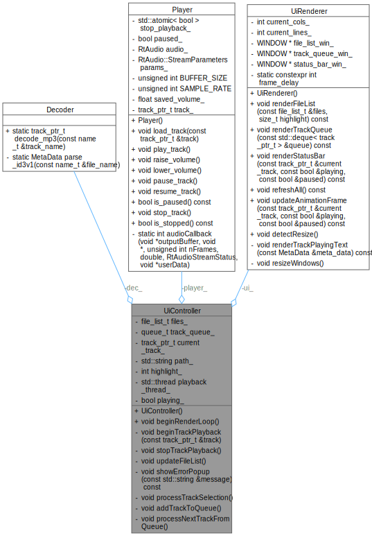
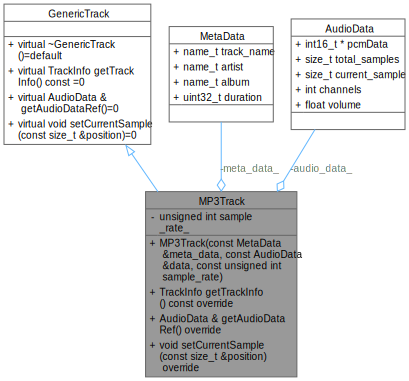

# Architecture overview

## MP3 Playback Handling

### Decoder

The decoder class implements the minimp3 library.

Its purpose is to decode an MP3 file and return a **Track** object.

### Player

The player class handles **Track** objects.

It first needs to load a **Track** (Player::load_track(track))

Its main method - Player::play_track() is intended to be used on a separate thread.

- The method can be then controlled from the outside using the public interface e.g. Player::pause_track()

### Track

A set of classes that hold track info 

- General track information - metadata
- Data crucial for playback - sample rate, PCM data, channel count

## UI

The UI of the app is created with the support of ncurses

### UiController

Runs the main render loop for the entire user interface

Takes care of user input

Evaluates current states and delegates rendering jobs to the renderer

### UiRenderer

Helper class for the UiController

Receives data from the controller and updates specific windows of the app

## Class design diagram

## Role of external libraries

1. `minimp3`
    - minimp3 is used by the `Decoder` class specifically as the process of deciphering an mp3 file is very complex.
    - It outputs raw PCM data that can later be used for audio streaming.

2. `RtAudio`
    - The `Player` class opens an audio stream with RtAudio.
    - RtAudio automatically detects an audio backend that the user has installed and handles all communication with it.

3. `ncurses`
    - The `UiController` and `UiRenderer` use ncurses display the app
    - UiController processes key input provided by the ncurses instance
    - UiRenderer uses ncurses' many methods to give the app a nice and clean visual

## API / Further possible expansions

The Decoder currently only has one public method: decode_mp3

This however could be expanded by adding more methods to the Decoder and thus the app could support more audio formats

- WAV could be simple to implement as it does not feature any compression.
- The object design of `Track` is prepared for this as all Tracks have a common ancestor.

A known improvement that could be made is switch from loading tracks in the queue into memory as a whole into some kind of streaming mechanism.

- It is important to keep the transitions between tracks seamless so decoding every time a song is fetched from the queue would not be ideal.
- The best way to solve this would then be streaming the files.

The `Player` is a modular block that could be perfectly used without the UI just by someone calling its extensive public interface.

- As shown in the demo where audio playback was just a console app with no UI features
