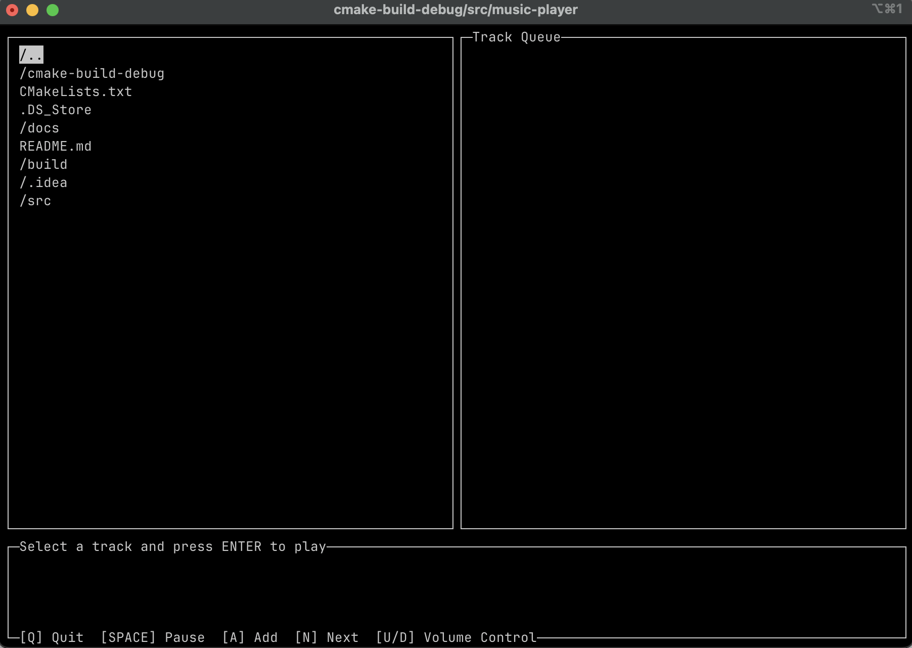
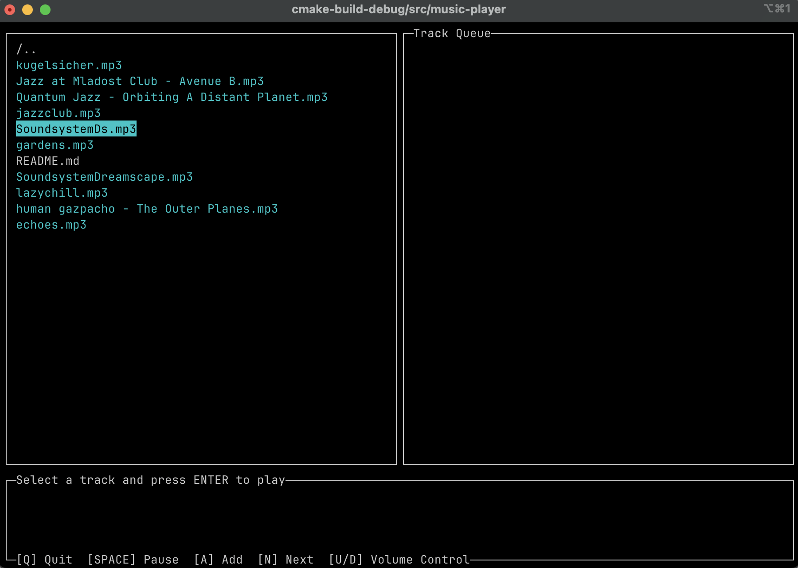
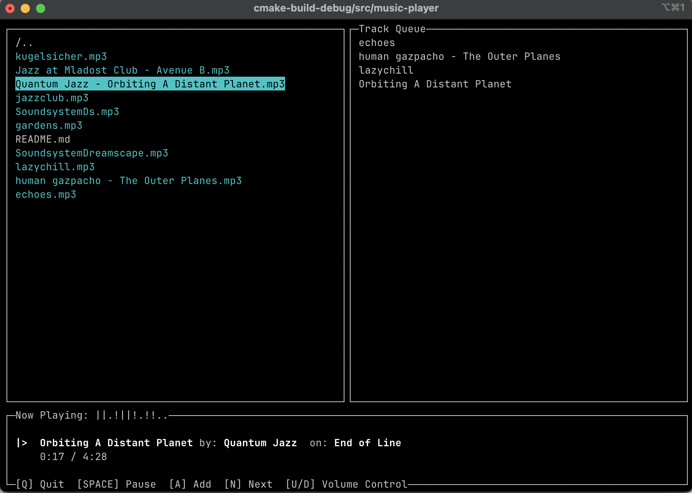

# Use-case Example

Once you start the app in your terminal of choice you get greeted with the following screen:

Here you can go up a directory by selecting the top element in the browser: `/..`

Use the `arrow keys` to move up and down in the file explorer and press `enter` to go into a directory.

Directories are marked by a prefix: `/dirname`

### Entering a directory with playable files

Once you enter a directory where valid files for playback are located, they will be highlighted by a special color.

Selecting an invalid file will result in a short error popup.

Once the cursor is over a valid file you can either:

- Play it right now by pressing `enter`
- Add it to the queue by pressing `a`

### Playing state

When a track is playing the status bar at the bottom of the screen will keep updating showing information about the track.

- Information about the artist and album will only show up if the file has a properly set-up footer
- Playback timer is updating in real time

You can press `space` to pause the track and press it again to resume playing.

When a track finishes playing it will look at the queue and if something is stored in it, that track will begin playing immediately after.

Press `n` to instantly skip the current track and play the next one from the queue.
    If no tracks are in the queue, the app just goes back to the default state.
